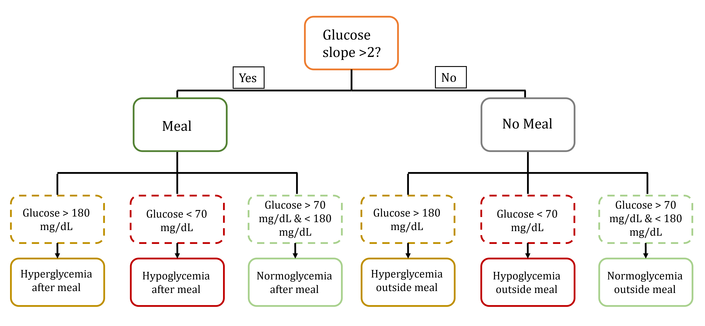

```{r setup, include=F, message=F}
knitr::opts_knit$set(root.dir = 'C:/Users/Garnica/OneDrive - Universitat de Barcelona/Documentos/UOC/TFM/DiaTrack')
knitr::opts_chunk$set(echo = T, warning = F,include=T, message=F,
                      results="markup", cache=T, 
                      fig.path = "figs/" ,
                      dev="png")
```

# Define parameters to use for analysis

## Load utilities and environment

```{r Utils, results=F, message=F}
# Load packages
library(tidyverse)
library(lubridate)
library(renv)
options(renv.verbose = F)

# Load the same packages versions using renv package
restore() 

# Load utilities
source("scripts/Utils.R")
```

## Diabetes manegement parameters

We define the parameters we will use for our analysis. The threshold for hypoglycemia and hyperglycemia, the raw data source type, the time period we want to study and the how we categorize the times of the day and define event time span.

```{r analysis_parameters}
#Set low and high threesholds:
low <- 70
high <- 180

# set the source of glucose data
glucose_source <- "xdrip"
# set the source of insulin pump data
insulin_source <- "MiniMed"

#dates interval to show
from <- "2022-07-16"
to <- "2023-01-29"

## setting times of the day
morning <- c(7,12)
midday <- c(13,15)
afternoon <- c(16,19)
evening <- c(20,23)
nigth <- c(0,6)

# Setting time span around events
time.bf <- (90*60) #time analysis before event in minutes (1.5h)
time.af <- (180*60) # time analysis after event in minuts (3h)
```


# Load and process CGM data
In this step we use the function `CGM_process()` to convert datetime data from CGM source into `POSIXct`format. Also, we compute the slope in **mg/dL/min** between glucose reading entries (`slope`) and every 15 minutes (`slope15`).

```{r load_CGM_data}
# Load function
source("scripts/CGM_process.R")
# Set glucose source path
glu_path <- "data/CGM_xDrip_export_20230126-165100.csv"

# Process glucose data
glucose <- CGM_process(glupath)
```

```{r show_glucose_processed_data}
kable(glucose[100:106,])
```

# Load and process Insulin pump data

In this step we use the function `Insulin_process()` to tidy up raw data from Minimed Pump (Medtronic) and also estimate the insulin in plasma levels using the model from Schiavon et al., 2018.

```{r model_image, echo=F, out.width = "50%", fig.align = "center"}

```
*Model exracted from (Schiavon, Dalla Man, and Cobelli 2018). U: Units of insulin injected, t: time, Г: time delay, Isc1:Insulin compartment1 (subcutaneous), Isc2: Insulin compartment 2 (Interstitial), Ip: Insulin compartment 3 (plasma), Kd: rate of diffusion from compartment 1 to 2, Ka1: rate of diffusion from compartment 1 to 3, ka2: rate of diffusion from compartment 2 to 3, ke: rate of clearance from compartment 3, V1: plasma volume.*

```{r Process_insulin}
# source function
source("scripts/Insulin_pump_process.R")
# define raw data insulin path
ins_path <- "data/Insulin_pump_MiniMed_8-3-2023.csv"

# Arrange insulin events and data and compute insulin in plasma
tins <- Insulin_process(ins_path)
```

```{r show integrated insulin}
kable(tins[206145:206151,])
```


# Merge glucose and insulin datasets

Now we merge glucose levels and insulin events data, and get rid of time entries without meaningful information.

```{r join_datasets}
fi <- left_join(tins, glucose, by="time") %>%
  # remove not need rows
  filter(!is.na(glucose) |
         !is.na(Bolus_type) |
         !is.na(Action))
```


# Classify events

Next we create a new dataframe with the events in this period of time. This dataframe can be linked to the integrated dataset with minute-wise information based on date and time data. We use the function `Event_classification()`.

```{r classification_image, echo=F, out.width = "50%", fig.align = "center"}

```

*Events were firstly classified in meal and non-meal events based on presence of increasing slope of at least 2 mg/dL/min, and then into events with normo-, hyper- or hypoglycemia, based on the presence of at least 3 glucose values below or over the low and high thresholds. Start and end time for analysis event was set as 1.5h before and 3h after of event declaration parameter.*

At the same time we categorize datetime in weekdays, hours, and timeday for the subsequent analyses and plotting. Moreover, we compute the following parameters associated with each event:

* **Extreme value**: only applicable to events with hypo- or hyperglycemia, with lowest and highest glucose value, respectively (mg/dL).
* **AUC out of range**: Only applicable to non-normoglycemic events. Area under the curve outside of range. Most current analyses consider the amount of time out of range, but AUC also measures the extend of the hypoglycemia or hyperglycemia. 
* **Total slope**: Only applicable to no normoglycemic events. Slope of glucose (mg/dL/min) before arriving to out-of-range glucose values.
* **Diff_bolus**: Time difference between last bolus and out-of-range glucose levels in minutes.
* **Bolus_ActI, Basal_ActI and Total_ActI**: Units of insulin in plasma from bolus, basal or total (sum of bolus and basal), respectively, at the time of event declaration.
* **N_bolus**: Number of boluses delivered over the period of event analysises (-1.5-+3h)


```{r Event_classification}
# Load function
source("scripts/Event_classification.R")
# Classifiy events, compute associated variables and categorize datetime
events <- Event_classification(fi)
```

```{r show events}
kable(head(events))
```

# Analysis

We also categorize datetime in weekdays, hours, and timeday of the glucose and insulin data integrated dataframe, using the funcion `Categories_time()`.

```{r Categories_integrated}
# Load function
source("scripts/Categories_time.R")
# Function to obtain ranges of glucose data, risk, and
# time of the day and time of the week of time points
fi <- Categories_time(fi)
```

```{r show integrated}
kable(head(fi))
```

## Diabetes measuraments

We use the previous integrated and events datasets to obtain meaningful and interpretable values of overall diabetes management success in a summary table, using the function `Summary_diabetes_measures()`: 

```{r summary_measures}
# Load function
source("scripts/Summary_diabetes_measurements.R")

# Compute summary measures
Diabetes_summary <- Summary_diabetes_measures(glucose, fi, events)
```

```{r show diabetes summary}

for(i in names(Diabetes_summary)){
  cat(i, "\n")
  kable(Diabetes_summary[[i]])
}
```


```{r save_summary, echo = F}
writexl::write_xlsx(Diabetes_summary,
                    paste0("out/stats_measurement",".xlsx"))
```

## Stats

### Chi-squared test for weekday and time day distribution of undesired events

In this part we aim to explore significant correlation of undesired diabetes management events (hypoglycemia and hyperglycemia) and days of the week and/or times of day. The aim of this is to mainly try to find moments of the week or day statistically more prone to undesired events in order to focus the diabetes management adjustments. This endeavor was addressed by performing chi-square test on the number of hyper- and hypoglycemia events, respectively, in each time day of the week and each time of the day (*morning, midday, afternoon, evening, and night*). 

```{r chisquare_tests}
# filter out not needed events (Normoglycemia) and not need variables
e2 <- events %>% 
  select(grep("type|AUC|ActI|extreme|N_bolus|timeday|weekday|start|end", names(.),value = T)) %>% 
  filter(Event_subtype != "Normoglycemia")

# Perform Chi-sequred test for hyper- and hypoglycemia
# for either time of day or weekday

cq.hyper <- e2 %>% filter(Event_subtype == "Hyperglycemia") %>%  
              with(table(weekday))
cq.hyper
chisq.test(cq.hyper)
cq.hypo <- e2 %>% filter(Event_subtype == "Hypoglycemia") %>%  
              with(table(weekday))
cq.hypo
chisq.test(cq.hypo)

cq2.hyper <- e2 %>% filter(Event_subtype == "Hyperglycemia") %>%  
              with(table(timeday))
cq2.hyper
chisq.test(cq2.hyper)
cq2.hypo <- e2 %>% filter(Event_subtype == "Hypoglycemia") %>%  
              with(table(timeday))
cq2.hypo
chisq.test(cq2.hypo)
```

### Events variables correlation

It was previously defined the list of events occurring within the period examined, at the same time we annotated in each of the event a list of variables associated with these events. The aim of this part of the project is to try to define which of such parameters are more correlated with each of the undesired events subtypes (hyperglycemia and hypoglycemia). 

We firstly prepare the data for the model application. 

```{r lm_preparation}
# Firstly, we filter out entries containing NA and
# normoglycemic events
e3 <- events %>% 
  filter(Event_subtype != "Normoglycemia") %>% 
  filter(complete.cases(.))
# Also, some time between event and bolus are infinite due to NA
# We convert them to the defined time of event
e3[is.infinite(e3$Diff_bolus),"Diff_bolus"] <- (time.bf+time.af)/60

# scaling and normalization
# select numerical variables for the model
num <- c("Total_slope", "Diff_bolus", "Bolus_ActI",
         "Basal_ActI", "N_bolus")
X <- e3[,num] %>% scale(.)
# We calculate norma L2 using apply
L2 <- apply(X, 2, function(x) {sqrt(sum(x^2))})
# we divied each value for its respective norma L2
X <- X/L2
```

The parameters `Extreme value` and `AUC out of range` were not added to the formula, since these would highly correlate with the subtype of event. Also, Total plasma insulin (`Total_ActI`) was removed as it is the sum of bolus and basal insulin.

```{r}
# Define categorical variables
cat <- c("Event_type", "Event_subtype", "weekday", "timeday")
# Build dataset for the model
lm.data <- cbind(e3[, cat], as.data.frame(X))
# Convert event subytpe to a binomial factor
lm.data <- lm.data %>% 
  mutate(Event_subtype = factor(Event_subtype,
                             levels=c("Hypoglycemia", "Hyperglycemia"),
                             labels=c(0,1), ordered = T)
         )
```

#### Logistic regression
Since this model presented two event outcome types, we choose a binomial logistic regression model using the following formula:

```{r glm}
lgm <- glm(Event_subtype ~ Total_slope + Diff_bolus + Bolus_ActI + 
            Basal_ActI + N_bolus + weekday + timeday,
            data= lm.data,
            family = binomial)
summary(lgm)
```


# Plots
```{r load plots functions}
# Load plots functions 

source("scripts/Plots.R")
```

## Combined glucose, risk and insulin plots on hours

Here we combine the glucose readings, computed risk based on glucose levels, insulin in plasma and insulin delivery events over the same period of time spanning several hours. It is useful to examine certain undesired events. 
We just need to use the function `gluplot()` indicating the events dataframe entry we want to show and the integrated dataset from where to extract the data.

```{r gluplot, fig.height=12, fig.width=7.5}
set.seed(22)
for(i in floor(runif(3, 1, nrow(events)))){
  cat("\n\n")
  print(gluplot(events[i,], fi))
}
```

## Percentile plots

Similar to previous plot, these plots summarize glucose reading, computed risk based on glucose levels, insulin in plasma and insulin delivery events. However, in this instance not only one event spanning few or some hours it is shown, but the distribution curves of some days or weeks. Both glucose and risk plots show: 1) The median of values (50th percentil), 2) the interquartile range (IQR); the 25th–75th percentile band, showing 50% of the values for each timepoint, 3) The 5th–95th percentile band, showing the 90% of the values for each timepoint. A similar plot is used for insulin in plasma levels, where is shown 1) Median levels for each time point and 2) the interquartile range (IQR); the 25th–75th percentile band, showing 50% of the values. Finally, the last part of the joined plot shows the number of events (bolus and start of basal temporal) for each time point.

The function `perplot()` uses the integrated dataset, a subtitle can be added is data was subsetted (`subtit`), and the time periods for grouping varibles is defined by `tx` (by default 20 mins).

```{r perplots, fig.height=18, fig.width=16}
# All values analyzed
perplot(fi)

# Only certain weekdays, for instance Tuesday
x <- fi %>% filter(weekday == "Tuesday")
perplot(x, subtit="Tuesday")

# Only certain time of day, for instance morning
x <- fi %>% filter(timeday == "morning")
perplot(x, subtit="morning", tx="5 mins")


# We can also define moment around meal events
x <- fi %>% filter(meal_factor == "outmeal")
perplot(x, subtit="Outmeal")


# or only show events of hyper- or hypoglycemia
for(o in c("Hyperglycemia","Hypoglycemia")){
  x <- data.frame(matrix(nrow=0, ncol=length(fi)))
  names(x) <- names(fi)
  idx <- which(events$Event_subtype == o)
  # Compute all variables for each subEvent based on the events dataframe
  for(i in idx){
    x0 <- fi %>% filter(time >= events[i,"start"] & time <= events[i,"end"])
    x <- rbind(x, x0)
  }
  print(perplot(x, subtit=o))
}
```

### Meal percentile plots
For reproducing the same time of plots but indicating time around meal events we created the funcion `mealplot()`, which works likes `perplot()` but setting as 0 the meal event.

```{r mealplot, fig.height=24, fig.width=15}
mealplot(fi)
```

## TIR plots
TIR (Time in Range) plots indicate the relative proportion of time during which glucose readings are within a target glucose range of 70–180 mg/dL. Additionally, time out of range can be subdivided into mild or severe hypoglycemia and hyperglycemia, respectively. Moreover, the function `TIR_plot()` allows to subset by weekday of time of day.

```{r TIR_plots, fig.width=12}
TIR_plot(fi)
TIR_plot(fi, subset="weekday")
TIR_plot(fi, subset="timeday")
```

## Poincaré plot

Poincaré plots provide a look to the stability of the system (in this case glucose stability). This plot is often used in physics to visualize the dynamic behavior of the investigated system (Brennan, Palaniswami, and Kamen 2001): a smaller, more concentrated plot indicates system (patient) stability, whereas a more scattered Poincaré plot indicates system (patient) irregularity, reflecting in our case poorer glucose control and rapid glucose excursions. Each point of the plot has coordinates BG(ti-1) on the y-axis and BG(ti) on the x-axis. Thus, the difference (y-x) coordinates of each data point represent the BG Rate of Change occurring between times. In the `Poincare_plot` function the red ellipse depicts 99% of the values by default. Data can also be shown subsetting it by factors such as weekday or time of the day.

```{r Poincare_plot, fig.width=6, fig.height=6}
Poincare_plot(fi)
Poincare_plot(fi, subset = "weekday")
Poincare_plot(fi, subset = "timeday")
```


## Event-based clinical characteristics CVGA (24h periods)

Control Variability Grid Analysis (CVGA) is a valuable tool used to assess the glycemic regulation. This graphical representation presents the minimum and maximum glucose values within a period of time, offering both a visual and numerical evaluation of the overall quality of glycemic control (Magni et al. 2008). 

We need to extract max and minim values for given time (all 24h, a certain day or moment...) and pass this data to the funcion `ebc.plot()`.

```{r CVGA plots, fig.height=5, fig.width=7}
# EBC plot for 24 h period of all days
fi %>% 
  mutate(day = format(time, "%D")) %>% 
  group_by(day) %>% 
  summarize(Max = max(glucose, na.rm = T),
            Min = min(glucose, na.rm=T)) %>% 
  ebc.plot(tit="24h")

# On Afternoon
fi %>% 
  mutate(day = format(time, "%D")) %>% 
  group_by(day, timeday) %>% 
  summarize(Max = max(glucose, na.rm = T),
            Min = min(glucose, na.rm=T)) %>% 
  filter(timeday == "afternoon") %>% 
  ebc.plot(tit=i) %>% print()

# On Mondays
fi %>% 
  mutate(day = format(time, "%D")) %>% 
  group_by(day, weekday) %>% 
  summarize(Max = max(glucose, na.rm = T),
            Min = min(glucose, na.rm=T)) %>% 
  filter(weekday == "Monday") %>% 
  ebc.plot(tit=i) %>% print()


# After meal
fi %>% 
  mutate(day = format(time, "%D")) %>% 
  group_by(day, meal_factor) %>% 
  summarize(Max = max(glucose, na.rm = T),
            Min = min(glucose, na.rm=T)) %>% 
  filter(meal_factor == "postmeal") %>% 
  ebc.plot(tit=i) %>% print()

```

## boxplot

Boxplot offer the possibility to visualize and assess the distribution, hence the variability, in glucose readings or risk within specific times. They offer similar information than percentile plots but showing the variability based on days of the week or time of the days. On top of that, we also added each of glucose or risk measures to better examine the number of glycemic excursions in each time period and to get a sense of the time in range.
The funcion `Boxplot_glucose()` takes the integrated data, and allow to define x-axis (Glucose or risk) and y-axis (weekday of time of the day):

```{r boxplot}
Boxplot_glucose(fi)
Boxplot_glucose(fi, xaxis = "timeday", yaxis="risk")
```

## Events plots

Event plots show the mean number of events: hyperglycemia, hypoglycemia and meals, happening for each specific time period. This plot is helpful in conjunction with previous Chi-squared analysis to find moment of the day or days of the week where patient can be more prone to undesired events.
The function `Event_plot()` requires the integrated and events dataset, and events can be divided by weekday or time of the day by the variable `subset`.

```{r Event_plots}
Event_plot(fi, events)
Event_plot(fi, events, subset="timeday")
```


